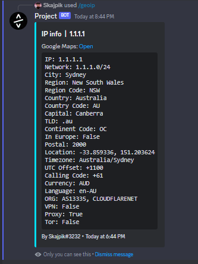

# Discord Bot - Geo IP
## Gives basic info about ip

<br>



<br><br>

# Installation
linux
```
git clone https://github.com/SkajpCZ/DiscordGeoIp
cd DiscordGeoIp
pip install -r requirements.txt
<Add your token to .token file>
python3 geoip.py
```

